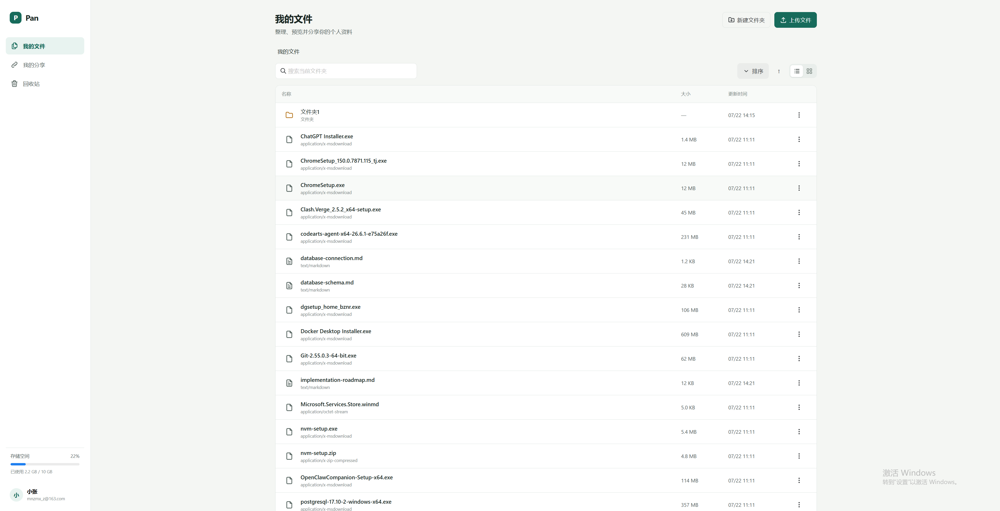

# Pan 私人云盘

Pan 是一个可自行部署的多用户私人云盘。用户可以在浏览器中上传、整理、预览、下载和分享文件；系统管理员可通过独立后台查看运行数据、管理用户状态和容量配额。

项目采用 Vue 3 + FastAPI + PostgreSQL，并提供完整的 Docker Compose 部署方案。上传的原始文件直接保存在项目目录中，便于迁移和备份。



## 功能

### 用户网盘

- 邮箱注册、登录、修改密码和退出登录
- 文件夹层级、面包屑导航、名称搜索和排序
- 文件上传、下载和上传进度显示
- 图片、PDF、纯文本、音频和视频基础预览
- 新建文件夹、重命名、移动、复制和删除
- 列表与网格视图多选，批量移动、复制或移入回收站
- 列表与网格两种浏览方式
- 回收站恢复、永久删除和一键清空
- 文件或文件夹只读分享、分享有效期和取消分享
- 用户数据隔离、容量配额与单文件大小限制

### 管理后台

- 独立入口：`/admin`
- 与普通用户完全分离的管理员登录接口
- 系统用户数、文件数和存储占用统计
- 用户启用与停用；停用后现有登录立即失效
- 调整每个用户的存储容量配额
- 系统只允许存在一个管理员账号
- 初次登录强制修改初始密码

## 技术架构

| 层级 | 技术 |
| --- | --- |
| 前端 | Vue 3、TypeScript、Vite、Pinia、Axios、Naive UI |
| 后端 | FastAPI、SQLAlchemy 2、Pydantic v2、Alembic |
| 数据库 | PostgreSQL 16 |
| 网关 | Nginx |
| 部署 | Docker、Docker Compose |
| 文件存储 | 项目目录 `data/files` |

浏览器只需要访问前端服务。前端容器中的 Nginx 会将 `/api` 请求转发到 FastAPI，FastAPI 负责权限、文件元数据和磁盘文件，PostgreSQL 仅保存业务数据。

```text
浏览器
  └─ :8080  前端 Nginx
       ├─ Vue 静态页面
       └─ /api → FastAPI :8000
                    ├─ PostgreSQL
                    └─ data/files
```

## 快速启动

### 环境要求

- Docker Engine 或 Docker Desktop
- Docker Compose v2（能够执行 `docker compose`）
- 首次构建时需要访问 Docker 镜像站和软件包镜像站

### 获取项目

```bash
git clone https://github.com/zhangmingxin0120/pan.git
cd pan
```

### 配置环境变量

```bash
cp .env.example .env
```

本地体验可以直接使用示例配置。部署到服务器前，至少修改以下内容：

```dotenv
POSTGRES_PASSWORD=请替换为足够长的随机密码
SECRET_KEY=请替换为足够长的随机字符串
```

可使用下面的命令生成 `SECRET_KEY`：

```bash
openssl rand -hex 32
```

主要配置项：

| 变量 | 默认值 | 说明 |
| --- | --- | --- |
| `POSTGRES_DB` | `pan` | PostgreSQL 数据库名 |
| `POSTGRES_USER` | `pan` | PostgreSQL 用户名 |
| `POSTGRES_PASSWORD` | `pan_local_password` | PostgreSQL 密码，生产环境必须修改 |
| `SECRET_KEY` | 本地示例值 | JWT 签名密钥，生产环境必须修改 |
| `DEFAULT_QUOTA_BYTES` | `10737418240` | 普通用户默认容量，默认 10 GiB |
| `MAX_FILE_SIZE_BYTES` | `1073741824` | 单文件上限，默认 1 GiB |
| `ADMIN_USERNAME` | `administrator` | 唯一管理员账号 |
| `ADMIN_INITIAL_PASSWORD` | `123456` | 仅用于首次登录的管理员初始密码 |

### 启动应用

Linux / macOS：

```bash
chmod +x restart.sh
./restart.sh --build
```

Windows：

```powershell
.\restart.cmd --build
```

首次启动会构建镜像、执行数据库迁移并启动三个服务。构建成功后访问：

- 用户端：<http://localhost:8080>
- 管理端：<http://localhost:8080/admin>
- FastAPI 文档：<http://localhost:8000/docs>

管理员初始登录信息：

```text
账号：administrator
密码：123456
```

首次登录后必须设置至少 8 位的新密码。新密码保存在 PostgreSQL 中，重启容器或重新部署不会重置密码。

## Ubuntu 服务器部署

下面以已经安装 Docker Engine、Docker Compose、Git 和 Nginx 的 Ubuntu 服务器为例。

### 1. 下载并配置

```bash
sudo mkdir -p /opt/pan
sudo chown "$USER":"$USER" /opt/pan
git clone https://github.com/zhangmingxin0120/pan.git /opt/pan
cd /opt/pan
cp .env.example .env
nano .env
```

在 `.env` 中修改数据库密码和 `SECRET_KEY`，然后启动：

```bash
chmod +x restart.sh
PAN_NO_OPEN=1 ./restart.sh --build
```

确认服务状态：

```bash
docker compose ps
curl http://127.0.0.1:8080/health
```

### 2. 使用宿主机 Nginx 反向代理

是的，宿主机 Nginx 只需代理到 `127.0.0.1:8080`。FastAPI 和 PostgreSQL 之间的转发已由 Docker Compose 和前端容器处理。

创建 `/etc/nginx/sites-available/pan`：

```nginx
server {
    listen 80;
    server_name pan.example.com;

    client_max_body_size 1024m;

    location / {
        proxy_pass http://127.0.0.1:8080;
        proxy_http_version 1.1;
        proxy_set_header Host $host;
        proxy_set_header X-Real-IP $remote_addr;
        proxy_set_header X-Forwarded-For $proxy_add_x_forwarded_for;
        proxy_set_header X-Forwarded-Proto $scheme;
        proxy_request_buffering off;
        proxy_read_timeout 3600s;
    }
}
```

将 `pan.example.com` 替换为实际域名，然后启用配置：

```bash
sudo ln -s /etc/nginx/sites-available/pan /etc/nginx/sites-enabled/pan
sudo nginx -t
sudo systemctl reload nginx
```

建议使用 Certbot 配置 HTTPS，并在服务器防火墙或云安全组中只开放 `80` 和 `443`。不要将 PostgreSQL 端口暴露到公网；`8000` 和 `8080` 也不需要对公网开放。

### 3. 更新版本

代码更新后需要重新构建镜像：

```bash
cd /opt/pan
git pull
PAN_NO_OPEN=1 ./restart.sh --build
```

仅重启现有版本时无需构建：

```bash
PAN_NO_OPEN=1 ./restart.sh
```

启动脚本不会执行 `docker compose down`，构建失败时不会主动停止当前正在运行的服务。

## 数据保存与备份

Pan 有两类持久化数据：

| 数据 | 保存位置 | 说明 |
| --- | --- | --- |
| 上传的原始文件 | 项目根目录 `data/files` | 通过 bind mount 挂载到后端容器 `/data/files` |
| 用户、目录、分享等元数据 | Docker volume `pan_postgres_data` | PostgreSQL 数据目录 |

在 Ubuntu 示例部署中，上传文件实际位于：

```text
/opt/pan/data/files
```

实体文件不会全部平铺在一个目录中，而是采用“UTC 日期 + UUID 前缀分片”的布局：

```text
data/files/YYYY/MM/DD/{UUID前2位}/{完整UUID}

# 示例
data/files/2026/07/22/03/03ffc894940646b6ad8482d0516122e6
```

日期分区方便增量备份，UUID 前缀将同一天的文件均匀分散到 256 个目录中，避免单目录文件过多。用户看到的文件夹、文件名和层级由 PostgreSQL 管理，因此移动或重命名网盘文件不会移动实体文件。旧版本的平铺文件会在后端启动时自动、可恢复地迁移到新布局。

建议同时备份文件目录和 PostgreSQL。示例：

```bash
cd /opt/pan
tar -czf pan-files-$(date +%F).tar.gz data/files
docker compose exec -T db pg_dump -U pan -d pan > pan-db-$(date +%F).sql
```

普通的 `docker compose down` 不会删除数据，但不要在包含真实数据的环境中执行：

```bash
docker compose down -v
```

该命令会删除 PostgreSQL 数据卷。迁移服务器时，必须同时迁移 `data/files` 和 PostgreSQL 备份，否则数据库记录与实际文件会不一致。

## 常用运维命令

```bash
# 查看服务状态
docker compose ps

# 查看所有服务日志
docker compose logs -f

# 只查看后端日志
docker compose logs -f backend

# 停止服务但保留数据
docker compose down

# 启动已有镜像
docker compose up -d --no-build
```

如果构建时出现 `TLS handshake timeout`，通常是当前镜像站网络不稳定。可以在 `.env` 中修改 `PYTHON_IMAGE`、`NODE_IMAGE` 和 `NGINX_IMAGE`，换成服务器能够稳定访问的镜像地址后再次执行 `./restart.sh --build`。

## 本地开发

前端：

```bash
cd frontend
npm install
npm run dev
```

后端需要 PostgreSQL。可以先通过 Compose 启动数据库，再运行 FastAPI：

```bash
docker compose up -d db
cd backend
python -m venv .venv
source .venv/bin/activate
pip install -r requirements-dev.txt
alembic upgrade head
uvicorn app.main:app --reload
```

质量检查：

```bash
cd frontend
npm run typecheck
npm run lint
npm run build

cd ../backend
pytest
```

## 项目结构

```text
pan/
├─ frontend/           Vue 3 前端与容器内 Nginx 配置
├─ backend/            FastAPI、SQLAlchemy、Alembic 与测试
├─ data/files/         按日期和 UUID 分片保存的上传文件，不提交到 Git
├─ docker-compose.yml  PostgreSQL、后端和前端编排
├─ restart.sh          Linux / macOS 启动脚本
├─ restart.cmd         Windows 启动脚本
├─ .env.example        环境变量示例
└─ demo.png            产品界面截图
```

更详细的产品范围、设计规则和后端约定参见 [PRODUCT.md](./PRODUCT.md)、[DESIGN.md](./DESIGN.md) 和 [BACKEND.md](./BACKEND.md)。
